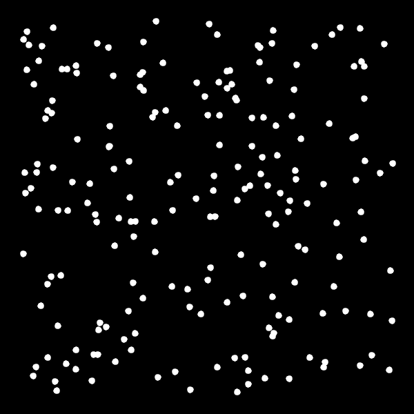

# prims-algorithm

This is an implementation of [Prim's algorithm](https://en.wikipedia.org/wiki/Prim%27s_algorithm) in [Processing](https://processing.org/). The algorithm is used to calculate the [minimum spanning tree](https://en.wikipedia.org/wiki/Minimum_spanning_tree) of a given undirected connected graph where each edge has a given weight. The minimum spanning tree is a [spanning tree](https://en.wikipedia.org/wiki/Spanning_tree) where the sum of the edge weights is as small as possible and where the graph has no cycles (edges forming closed loops). Another algorithm for calculating the minimum spanning tree is [Kruskal's algorithm](https://en.wikipedia.org/wiki/Kruskal%27s_algorithm).

The following animations show the process of generating the [Euclidean minimum spanning tree](https://en.wikipedia.org/wiki/Euclidean_minimum_spanning_tree) (EMST) of a set of input points. The EMST is a minimum spanning tree, where the nodes are points in the plane and the weights of the edges are the distances between the points. An efficient algorithm for EMST is Kruskal's algorithm combined with the [Delaunay triangulation](https://en.wikipedia.org/wiki/Delaunay_triangulation) which reduces the number of edges to the edges in the delaunay triangulation of the given input points.

